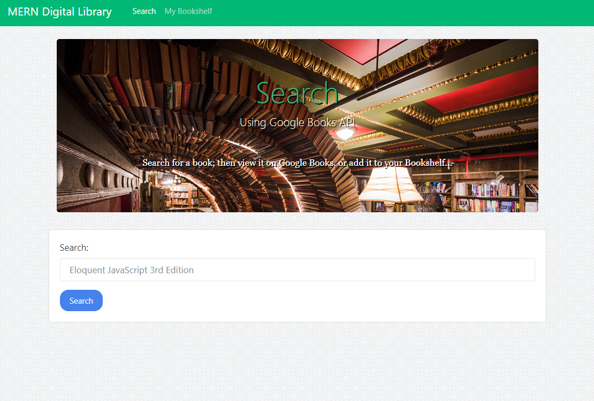
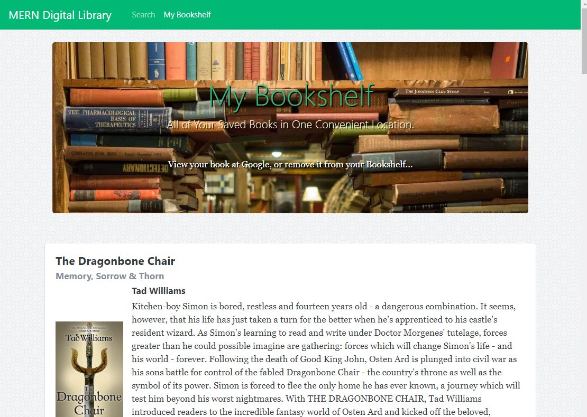

# Book Search Application using MongoDB, Express, React, &amp; Node

MERN-Library is a React-based Google Books Search application.  It allows you to search the Google Books API for books that you might like to read; displaying for you the book information including an image of the book, title, authors, description, published date, and number of pages.  Furthermore you are then able to save the book to your 'Bookshelf' to reference later.  You are also provided with a link to the book on Google's site.  The server for the application is supported by Node.js and Express and a MongoDB database is used to store your 'Bookshelf' which is queried via Mongoose.

## Deployment
